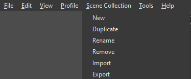
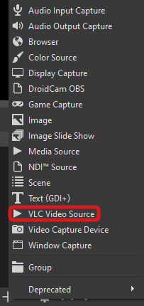
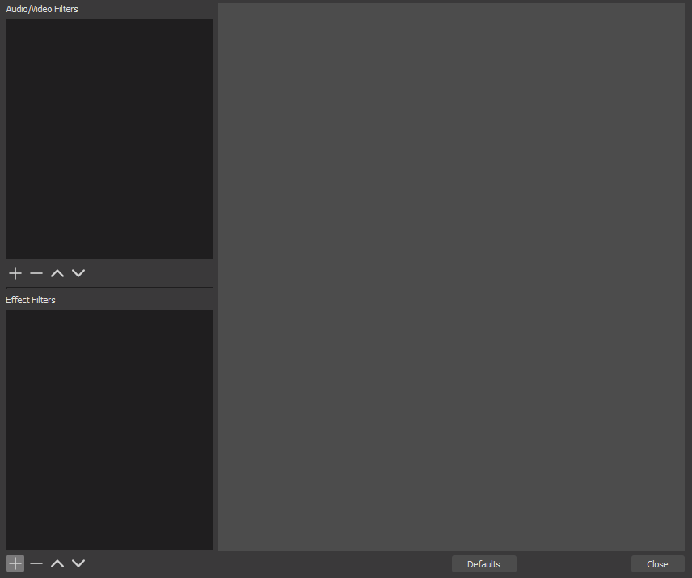
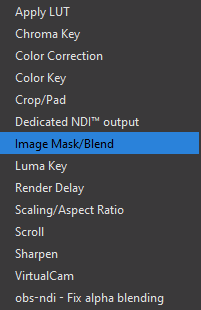
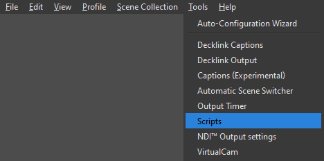
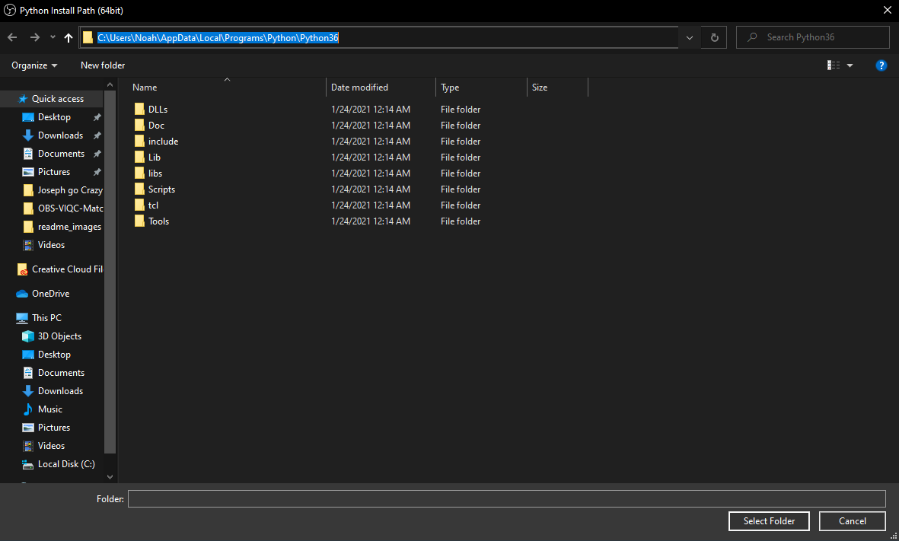
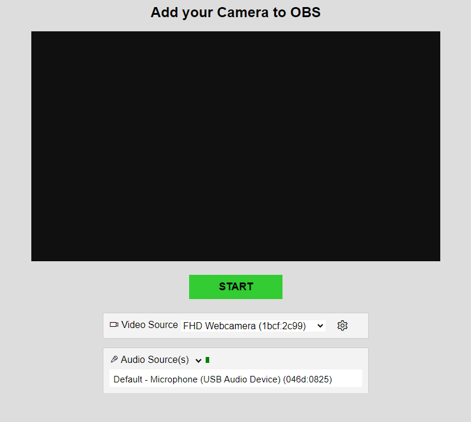
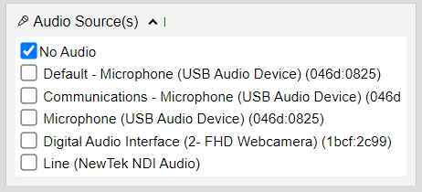
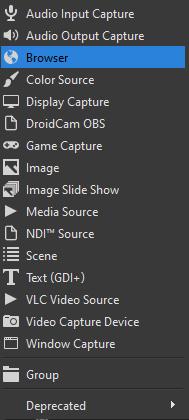
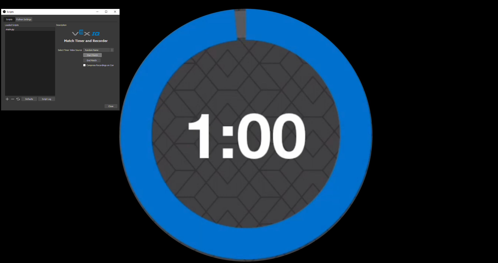

# OBS-VIQC-Recorder
This is a Script for OBS Studio to record your VEX IQ practice matches, with a timer overlay! 

To use, first download all the files on the [releases page] (https://github.com/AwesomeCoder72/OBS-VIQC-Recorder/releases/tag/v1.0.0). Unzip and place in a safe location. Then, follow the instructions below to setup your match recorder!

- [OBS-VIQC-Recorder](#obs-viqc-recorder)
    + [Install Python 3.6.8](#install-python-368)
    + [Creating a New Scene Collection.](#creating-a-new-scene-collection)
    + [Adding the timer source to OBS.](#adding-the-timer-source-to-obs)
    + [Cropping the timer source so it's just a circle. (optional)](#cropping-the-timer-source-so-it-s-just-a-circle--optional-)
    + [Adding the Script to OBS.](#adding-the-script-to-obs)
    + [Adding your video and field. (using obsninja)](#adding-your-video-and-field--using-obsninja-)
    + [Running a Match.](#running-a-match)
    + [You're all Done!!!](#you-re-all-done---)

### Install Python 3.6.8
1. Go to the [python.org](https://www.python.org/downloads/release/python-368/) website.
2. Scroll down to the bottom of the page, and 
    * if you are on Windows 64-bit (if you're on windows, you probably are on 64-bit), click the link that says: "Windows x86-64 executable installer"
    * if you are on MACOS, follow the instructions to install. 
3. Open the installer.
4. ***Make sure*** that Python 3.6.8 is added to PATH.
5. Click "Install Now"
### Creating a New Scene Collection.
1. Open OBS Studio.
2. In the top left corner of the window, click "Scene Collections".
3. Under "Scene Collections", click "New". 
    * 
4. Name your Scene Collection.
### Adding the timer source to OBS. (using (this video) [https://www.youtube.com/watch?v=k-TXJV90Bmk])
5. Add a new VLC Video Source
    * 
6. Name the VLC Video Source
7. Add the VEX IQ Timer.mp4 video to the VLC Video Source. It should look something like this:
    * 
8. Press OK, the full-screen timer video should now display on the output.
    * If you cannot see it, but the audio is playing, click on the source and press ctrl+F to make it fit to screen.
9. To hear the timer, in the top left corner of the window, go to Edit->Advanced Audio Properties.
    * 
10. Then, under "Audio Monitoring" for the name of your source, set it to "Monitor and Output". This will play the sound effects both in the recording output, and in the recording preview. If you do not see your timer source, you may need to uncheck "Active Sources Only".
    * 
### Cropping the timer source so it's just a circle. (optional)
11. Right-click on your timer source.
12. Click "Filters".
13. Add an effect filter.
    * 
14. Select "Image Mask/Blend"
    * 
15. Press OK
16. Under "Type", press "Alpha Mask (Alpha Channel)".
    * 
17. Under "Path", press "Browse", and add the circlefilter.png file.
### Adding the Script to OBS.
18. In the top-left corner, under "Tools", click "Scripts". 
    * 
19. Under "Python Settings", click Browse, and Paste this into the top bar: C:/Users/Noah/AppData/Local/Programs/Python/Python36
    * ***Remember to replace "Noah" with your windows username. (If not on windows, find python installation directory)***
    * 
20. Under "Scripts", add main.py from the folder you installed from (you may have to search a bit to find the right folder, it may be under Downloads).
21. Now, you should see this!!!
    * 
    * Please note that the "Compress Recordings on Completion?" option is still in development and is not working yet.
22. Under "Select Timer Video Source", pick the name of the source that has the video of your timer.
### Adding your video and field. (using obsninja)
23. There are a plethora of ways to add a video source to OBS, so if you are more comfortable with another way, you do not need to follow this section.
24. On the device that will record your field, go to the website [obs.ninja] (https://obs.ninja). This may be a seperate phone/tablet/computer.
    * 
25. You may use any of the options to add your video to OBS, but for this tutorial, we will use "Add your Camera to OBS"
26. Click "Add your Camera to OBS"
27. Under "Video Source", select the camera you would like to use. (You may need to allow the website to access your camera and microphone.)
    * 
28. It is recommended to also disable audio, because of noisy feedback bugs that have been encountered due to the audio source and audio reciever being to close together, so under "Audio Source"
    * 
    * If you would like sounds coming from the robots in the final output of the recording, mess around with the audio settings in obsninja and OBS.
29. Click/Tap "Start"
    * Muting is recommended for the reasons mentioned above.
30. In the top left corner, where it says "Copy this URL into an OBS "Browser Source", click the link to copy it.
31. To add this video feed to OBS, add a new browser source.
    * 
32. Rename the Browser Source, and click OK
33. Set the Width and Height of the Browser source to match the resolution of the video recorder. A common one is 1280x720 for HD resolution.
34. Under "URL", paste/type in the URL you copied.
    * 
35. Now you should see your camera output!
36. To see the timer and your video at the same time, under sources, drag the timer source above the browser source. You can then resize it and place it wherever on your screen.
### Running a Match.
37. Start and Stop matches from the Scripts Window under Tools->Scripts as shown in step 18. When you press the "Start Match" button, it will immediately start recording a video and will stop recording either when you press "Stop Match" or when the timer has finished.
38. The way I find it easiest to see the timer and record the matches as the same time is to right click on the timer source under "Sources" and click on "Windowed Projection (Source)", set that window to full-screen, and put the Scripts Window on top. Then it looks like this. I have a large monitor, so I can just resize the Scripts window so I can see both at the same time. If you can't do that, just click onto the timer screen right after you press the "Start Match" button.
    * 
39. To find your recordings, in the top-left corner under "File", click "Show Recordings". 
    * 
### You're all Done!!!
If this worked correctly, you can now record your VEX IQ Matches whenever you want to practice!